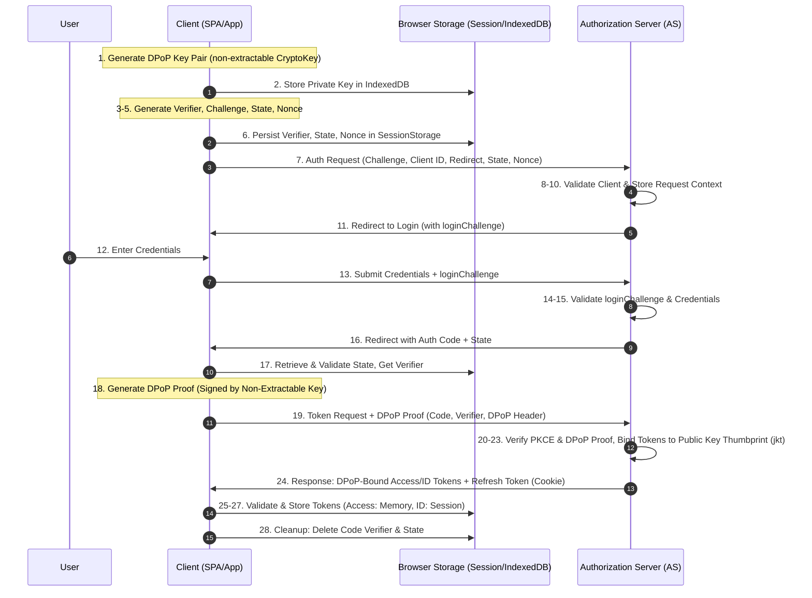
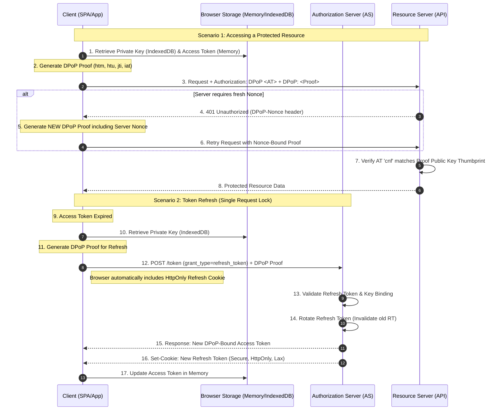

# Authentication & Authorization Protocol Specification

This document outlines the security architecture for user authentication and authorization using the **OAuth 2.0 Authorization Code Flow with Proof Key for Code Exchange (PKCE)**, enhanced with **Demonstrating Proof-of-Possession (DPoP)**, Refresh Token Rotation, and strict browser storage management.

## 1. Authorization Code Flow with PKCE & DPoP

### Sequence Diagram

### Process Details

1.  **DPoP Key Generation**: The Client generates an asymmetric key pair (typically ECDSA P-256) via the Web Crypto API.
2.  **Non-Extractable Storage**: The **Private Key** is stored in **IndexedDB** as a `CryptoKey` object with `extractable: false`. This prevents the key from being read or exported even if an attacker executes XSS. The Public Key is kept in memory.
3.  **Cryptographic Preparation**: The Client generates a **Code Verifier** (high-entropy cryptographic random string, Base64URL encoded).
4.  **Challenge Generation**: The Client creates a **Code Challenge** by calculating the SHA-256 hash of the Code Verifier.
5.  **State & Nonce**: The Client generates a **State** (CSRF protection) and a **Nonce** (ID Token replay protection).
6.  **Initial Persistence**: The Client stores the `code_verifier`, `state`, and `nonce` in **SessionStorage**.
7.  **Authorization Initiation**: The Client redirects the user to the AS with `code_challenge`, `client_id`, `redirect_uri`, `state`, and `nonce`.
8.  **AS Validation**: The AS validates the client identity and redirect URI.
9.  **Context Persistence**: The AS stores the challenge and state.
10. **Login Challenge**: The AS generates a `loginChallenge` for the UI.
11. **User Redirection**: The AS redirects the user to the login interface.
12. **User Authentication**: The user submits credentials.
13. **Credential Submission**: The Client transmits credentials and `loginChallenge` to the AS.
14. **Identity Validation**: The AS authenticates the user.
15. **Authorization Grant**: The AS redirects to the `redirect_uri` with a short-lived **Authorization Code** and `state`.
16. **State Validation**: The Client retrieves the original `state` from **SessionStorage**, ensures it matches the URL parameter, and then deletes the stored `state`.
17. **DPoP Proof Construction**: The Client generates a **DPoP Proof** (a JWT signed by the private key from IndexedDB) containing:
    - `htm`: The HTTP method (`POST`).
    - `htu`: The HTTP URL of the token endpoint.
    - `iat`: Issued-at time.
    - `jti`: Unique identifier to prevent DPoP proof replay.
    - `jwk`: The Public Key.
18. **Token Exchange**: The Client sends a `POST` to the token endpoint including the `code`, `code_verifier`, and the `DPoP` HTTP header.
19. **PKCE & DPoP Verification**: The AS:
    - Verifies the `code_verifier` matches the `code_challenge`.
    - Verifies the DPoP Proof signature.
    - Calculates the thumbprint (`jkt`) of the Public Key and binds it to the tokens.
20. **JWT Issuance**: The AS generates:
    - **Access Token**: Contains `cnf` claim with the `jkt` of the DPoP Public Key.
    - **ID Token**: Standard identity claims + `nonce`.
21. **Refresh Token**: Generated as an opaque string and bound to the DPoP key.
22. **Transmission**:
    - **Access & ID Tokens**: Returned in JSON body.
    - **Refresh Token**: Set via `Secure`, `HttpOnly`, `SameSite=Lax` cookie (Lax allows cross-site top-level navigation while maintaining security).
23. **Client-Side Signature/Nonce Verification**: The Client verifies the JWT signature and ensures the `nonce` in the ID Token matches the value in **SessionStorage**.
24. **Final Storage & Cleanup**:
    - **Access Token**: Stored **in-memory** only.
    - **ID Token**: Stored in **SessionStorage** for UI state.
    - **Code Verifier**: Deleted immediately.

---

## 2. Token Refresh & API Interaction with DPoP

To maintain security, every request to a protected Resource Server (RS) or the AS refresh endpoint must prove possession of the private key.

### Process Details

1.  **DPoP API Request**: The Client retrieves the non-extractable Private Key from **IndexedDB** to sign a proof. The proof is bound to the specific `htu` (URL) and `htm` (Method).
2.  **DPoP-Nonce Handling**: If the RS/AS responds with a `401` and a `DPoP-Nonce` header, the Client **must** regenerate the proof including the `nonce` claim and retry the request. This provides protection against pre-computed proof attacks.
3.  **RS Validation**: The RS performs "Sender-Constraining" by checking that the `cnf` thumbprint in the Access Token matches the Public Key used to sign the DPoP header.
4.  **Refresh Request Mutex**: In SPAs, the client must implement a logic lock (mutex) to ensure only one refresh request is sent at a time. This prevents race conditions where multiple failed API calls attempt to use the same Refresh Token simultaneously, which would trigger a "Reuse Detection" lockout.
5.  **Rotation & Binding**:
    - The AS validates the `HttpOnly` cookie and the DPoP proof.
    - **Token Rotation**: Every refresh issues a **new** Access Token and a **new** Refresh Token cookie.
    - **Family Revocation**: If an old Refresh Token is reused, the AS revokes the entire **Token Family**, requiring the user to log in again.
6.  **Logout Protocol**: Upon logout, the client must:
    - Explicitly call the AS logout endpoint.
    - Delete the DPoP Private Key from **IndexedDB**.
    - Clear the Access Token from **Memory**.
    - Clear the ID Token from **SessionStorage**.

---

## 3. Key Security Implementation Constraints

To ensure the integrity of this protocol, developers must adhere to the following constraints:

1.  **Non-Extractable CryptoKeys**: Keys **must** be stored as `CryptoKey` objects in IndexedDB. Serializing keys to strings (JWK/Base64) for storage allows XSS exfiltration and violates the DPoP security model.
2.  **Sender-Constrained Refresh (Double-Lock)**: A successful refresh requires both the **Browser Cookie** (protected from XSS via `HttpOnly`) AND the **DPoP Proof** (protected from exfiltration via non-extractable IndexedDB). An attacker who steals the cookie via proxy/CSRF cannot refresh tokens without the local private key.
3.  **Thumbprint Matching**: The RS/AS must verify that the `jkt` (JWK Thumbprint) of the Public Key in the DPoP header matches the `cnf` claim of the Access Token.
4.  **JTI Tracking**: The AS and RS should track `jti` (JWT ID) values for a short window (e.g., 5 minutes) to prevent replay of the same DPoP proof.
5.  **SameSite=Lax**: The Refresh Token cookie should use `SameSite=Lax`. This enables a better user experience for external entry points while DPoP provides the necessary protection against CSRF-based token refresh attempts.
